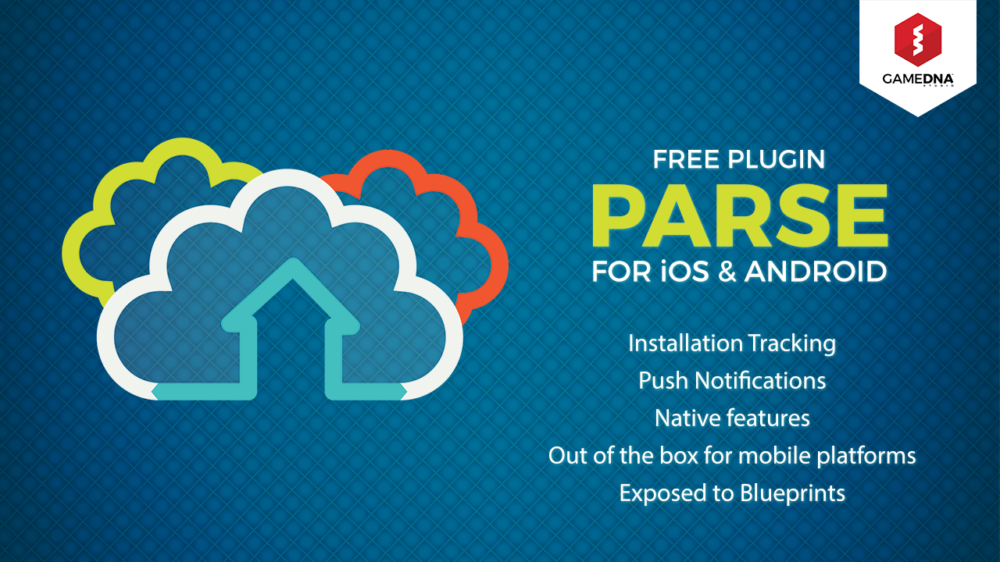
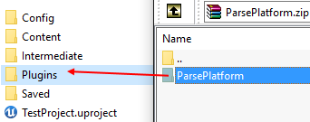
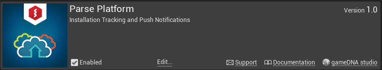
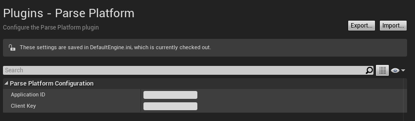

# Parse Platform

The **Parse Platform** plugin lets you integrate out-of-the-box [Parse.com](http://parse.com) native features into your Unreal Engine project (compatible with iOS & Android).

**Current version:** 1.0
**Binaries compiled for:** Unreal Engine 4.10.1

**Required Unreal Engine 4.10 or above.**

## Features
* Installation Tracking
* Push Notifications
* Out-of-the-box for mobile platforms: iOS & Android
* No additional libraries are needed
* Native implementation dedicated to specified platforms
* All features are exposed to Blueprints

## Setup
1. Copy this folder to the *Plugins* folder located in the main path of your project.

2. Enable *Parse Platform* in *Edit -> Plugins -> Messaging -> Parse Platform*.

3. Go to *Project Settings -> Plugins -> Parse Platform* and then enter *Application ID* and *Client Key*.

4. That's all! Parse Platform works now! :) All devices will be registered on [Parse.com](http://parse.com) and you will be able to send push notifications.
